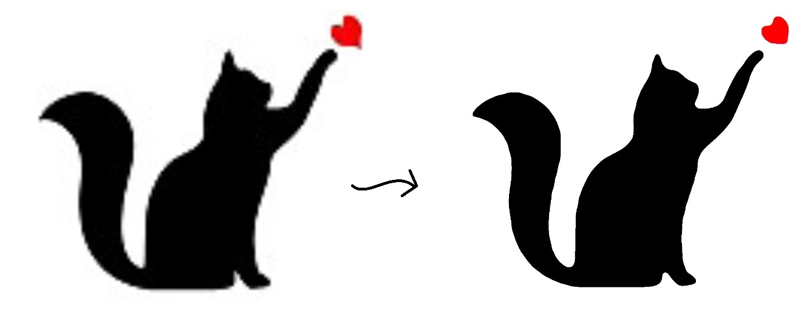

# Depixelate
Resize and depixel low resolution images.



## Usage

```console
$ pip install depixelate
```

```python
import cv2
import depixelate

original_image = cv2.imread('image.jpg')

result = depixelate.apply(original_image, 7, 600)
```

### Params
The **apply** method accepts 3 parameters:

- **Image (Required)**: Original image to be changed.
- **Weight (Optional)**: Indicates the power of the gaussian-blur algorithm. The higher the value, the more shape distortion. It must be between 1 and 10. Default value is 6.
- **Width Scale (Optional)**: Indicates the width of the output image. Default value is 800.

## Limitations
Depixelate library helps with logos and some graphics, but it doesn't help when maximum sharpness and detail is needed.<br />
In the majority of cases, you'll want to improve the quality of low resolution images (about 300 pixels wide or less). Otherwise you might be a little disappointed.

## Plans

- [ ] Depixelizing Pixel Art Implementation
